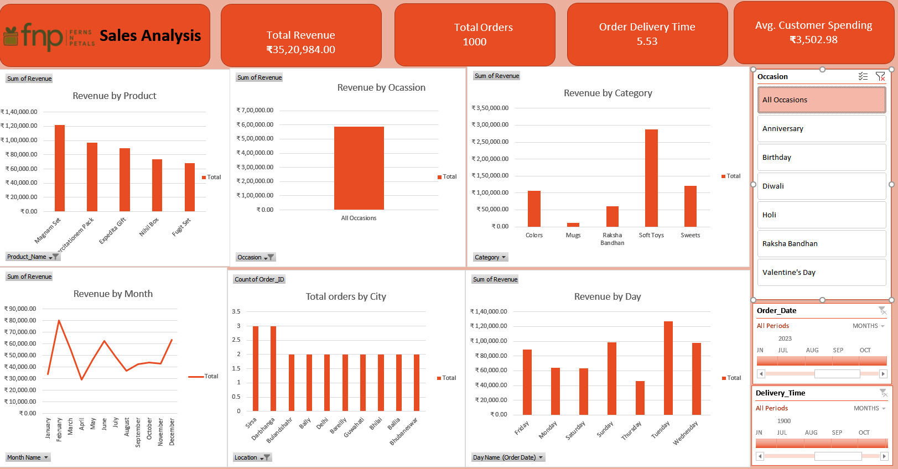

# 🎁 FNP Sales Analysis Dashboard

## Objective

In this project, I designed and built an end-to-end Excel analytics workflow for Ferns and Petals (FNP), a gifting brand serving occasions such as Diwali, Raksha Bandhan, Holi, Valentine's Day, birthdays, and anniversaries. The workflow consists of several stages:
1. Imported and cleaned raw customer, order, and product data in Excel.
2. Modeled relationships between the three datasets and built calculated columns and metrics.
3. Summarized the data using PivotTables and PivotCharts to answer specific business questions.
4. Assembled the results into an interactive KPI dashboard with slicers and timeline filters.

As this is a self-directed data analytics learning project, my emphasis is on demonstrating a full Excel workflow — from raw datasets to a business-ready dashboard — rather than on advanced statistical modeling.

The sections below explain additional details on the data, techniques, and files used.

## Table of Contents

- [Business Questions](#business-questions)
- [Dataset Used](#dataset-used)
- [Technologies](#technologies)
- [Data Analysis Workflow](#data-analysis-workflow)
- [Step 1: Data Cleaning & Preparation](#step-1-data-cleaning--preparation)
- [Step 2: Data Modeling & Calculated Columns](#step-2-data-modeling--calculated-columns)
- [Step 3: PivotTables & PivotCharts](#step-3-pivottables--pivotcharts)
- [Step 4: Dashboard Design](#step-4-dashboard-design)
- [Key Insights](#key-insights)
- [Recommendations](#recommendations)
- [Project Structure](#project-structure)
- [How to Use](#how-to-use)
- [What I Learned](#what-i-learned)

## Business Questions

The dashboard was designed to answer the following questions:

1. What is the overall revenue?
2. What is the average order and delivery time?
3. How does monthly sales performance fluctuate during 2023?
4. Which products generate the most revenue?
5. How much are customers spending on average?
6. How do the top 5 products perform?
7. Which are the top 10 cities by number of orders?
8. Does order quantity have an impact on delivery time?
9. How does revenue compare across different occasions?
10. Which products are most popular for specific occasions?

## Dataset Used

The project uses three primary datasets in the [`datasets`](./datasets) folder, brought together in [`SalesFYP.xlsx`](./Excel/SalesFYP.xlsx):

**[`customers.csv`](./datasets/customers.csv)** — 100 customers, with Customer ID, Name, City, Contact Number, Email, Gender, and Address.

**[`orders.csv`](./datasets/orders.csv)** — 1,000 orders, with Order ID, Customer ID, Product ID, Quantity, Order Date/Time, Delivery Date/Time, Location, and Occasion.

**[`products.csv`](./datasets/products.csv)** — 70 products, with Product ID, Product Name, Category, Price (INR), Occasion, and Description.

## Technologies

The following tools and techniques were used to build this project:
- Tool: Microsoft Excel
- Excel skills: Data Cleaning & Preparation, Data Relationships / Data Modeling, Calculated Columns, PivotTables, PivotCharts, Slicers, Timeline Filters, KPI Analysis, Business Intelligence & Visualization

## Data Analysis Workflow

```text
Raw Data
   ↓
Data Import
   ↓
Data Cleaning & Preparation
   ↓
Data Modeling / Relationships
   ↓
Calculated Columns & Metrics
   ↓
PivotTables
   ↓
PivotCharts
   ↓
Slicers & Timeline
   ↓
Interactive Sales Dashboard
   ↓
Business Insights
```

Files used at each stage:
- Step 1–3: [`customers.csv`](./datasets/customers.csv), [`orders.csv`](./datasets/orders.csv), [`products.csv`](./datasets/products.csv), consolidated in [`SalesFYP.xlsx`](./Excel/SalesFYP.xlsx)
- Step 4: [Dashboard](./Dashboard/Dashboard_SS.png) sheet in the workbook
- Full write-up: [`Ferns and Petals Sales Analysis.pdf`](./Ferns%20and%20Petals%20Sales%20Analysis.pdf)

## Step 1: Data Cleaning & Preparation

In this step, I imported the three raw CSV files into Excel and prepared them for analysis.

Tasks performed:
1. Loaded `customers.csv`, `orders.csv`, and `products.csv` into structured Excel Tables.
2. Standardized date and time fields (Order Date/Time, Delivery Date/Time) for consistent filtering.
3. Checked for missing or inconsistent values across the three tables.

## Step 2: Data Modeling & Calculated Columns

I built relationships between Customers, Orders, and Products (via Customer ID and Product ID) and added calculated columns and metrics, including:
- **Delivery Time** — derived from Order Date/Time and Delivery Date/Time
- **Revenue** — calculated from Quantity × Price per order
- **Average Customer Spending** — aggregated revenue per customer

## Step 3: PivotTables & PivotCharts

With the modeled data in place, I built PivotTables to summarize:
1. Revenue by Product, Occasion, Category, Month, and Day
2. Top cities by number of orders
3. Customer spending patterns
4. Order quantity vs. delivery time

These PivotTables feed the PivotCharts used directly in the dashboard.

## Step 4: Dashboard Design

After building the underlying PivotTables and charts, I assembled them into a single interactive KPI dashboard with slicers and timelines for Occasion, Order Date, and Delivery Time, allowing dynamic exploration of the sales data.



**Dashboard KPIs:**

| KPI | Value |
|---|---:|
| **Total Revenue** | ₹35,20,984 |
| **Total Orders** | 1,000 |
| **Average Delivery Time** | 5.53 days |
| **Avg. Customer Spending** | ₹3,502.98 |

**Dashboard components:**
- **Revenue Analysis** — Revenue by Product, Occasion, Category, Month, and Day
- **Customer & Order Analysis** — top cities by number of orders, customer spending, order quantity vs. delivery time
- **Interactive Filters** — Occasion, Order Date, and Delivery Time, letting users dynamically explore different segments

## Key Insights

From the dashboard's current view:
- Total revenue across all 1,000 orders is approximately **₹35.2 lakh**, averaging **₹3,502.98** per customer.
- **Magnam Set** is the top-revenue product, generating close to ₹1,40,000, notably ahead of the next best-performing products.
- **Soft Toys** is the strongest category by revenue, followed by Sweets, with Mugs generating the least.
- Monthly revenue is volatile, with a sharp spike in **February** and a second, smaller peak in **June**, rather than a steady upward trend.
- **Tuesday** stands out as the highest-revenue day of the week, with Thursday the lowest.
- Orders are spread thinly and fairly evenly across the top 10 cities (2–3 orders each), suggesting no single city dominates order volume.
- Average delivery time is just over **5.5 days**, which is worth benchmarking against customer expectations for gifting occasions.

> **Note:** Results change dynamically when different occasion, order-date, or delivery-time filters are selected.

## Recommendations

Based on the trends surfaced in the dashboard, a few actions stand out:

- **Feature and restock top performers.** Magnam Set and the broader Soft Toys category drive a disproportionate share of revenue — prioritizing their inventory and promotion is likely to have the biggest impact.
- **Investigate the February and June spikes.** Both months significantly outperform the rest of the year. Mapping them against occasions/holidays (e.g. Valentine's Day, Raksha Bandhan) could clarify what's driving demand and help plan future campaigns around it.
- **Address the Tuesday–Thursday gap.** Since Tuesday consistently outperforms other days, targeted promotions on slower days (like Thursday) could help smooth out weekly demand.
- **Review delivery time against expectations.** At ~5.5 days average, delivery speed is worth checking against customer expectations for time-sensitive gifting occasions — a delay analysis by city or occasion could reveal where improvements matter most.
- **Explore underperforming categories.** Mugs and Raksha Bandhan-specific products trail well behind Soft Toys and Sweets; understanding why (pricing, visibility, seasonality) could unlock incremental revenue.
- **Extend the analysis.** Layering profit margin (not currently in the dataset) alongside revenue would clarify whether high-revenue products and categories are also the most profitable ones.

## Project Structure

```text
📦 FNP_Sales_Analysis
│
├── 📁 Dashboard
│   └── 📊 Dashboard_SS.png
├── 📁 datasets
│   ├── 📄 customers.csv
│   ├── 📄 orders.csv
│   └── 📄 products.csv
├── 📁 Excel
│   └── 📗 SalesFYP.xlsx
├── 📕 Ferns and Petals Sales Analysis.pdf
└── 📄 README.md
```

## How to Use

1. Download the Excel workbook from the [`Excel`](./Excel/SalesFYP.xlsx) folder in this repository.
2. Open the workbook using Microsoft Excel.
3. Navigate to the **Dashboard** sheet.
4. Use the slicers and timelines to filter by Occasion, Order Date, or Delivery Time.
5. Explore revenue trends, customer spending, city-level order volume, and delivery performance.
6. Interact with the dashboard to analyze different business segments.

## What I Learned

This project helped strengthen my practical understanding of:
- Preparing and cleaning raw multi-table data for analysis
- Building relationships between related datasets
- Creating calculated columns and business metrics
- Building PivotTables and PivotCharts
- Creating interactive KPI dashboards
- Translating business questions into measurable insights
- Presenting analysis in a business-friendly format

---

*Skills demonstrated: `Excel` `Data Cleaning` `Data Modeling` `PivotTables` `PivotCharts` `KPI Analysis` `Data Visualization` `Dashboarding`*
